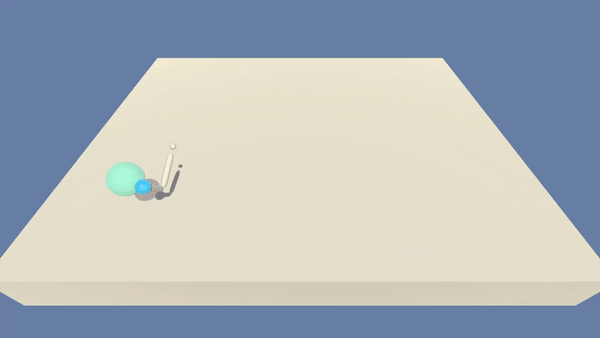
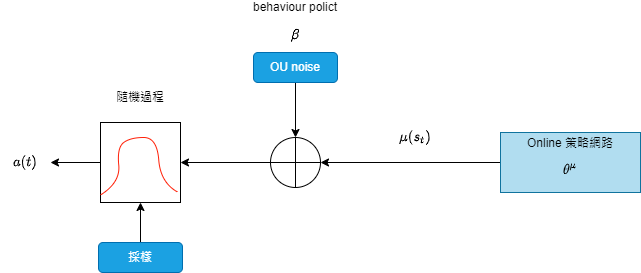
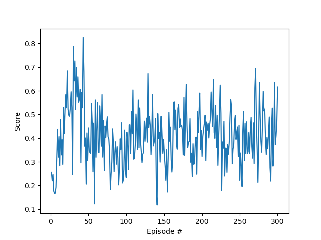
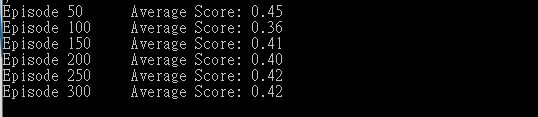
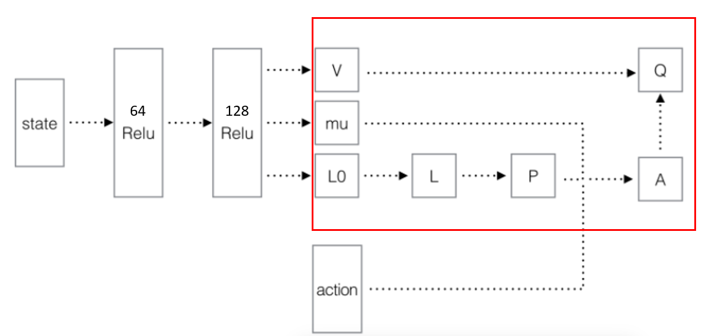
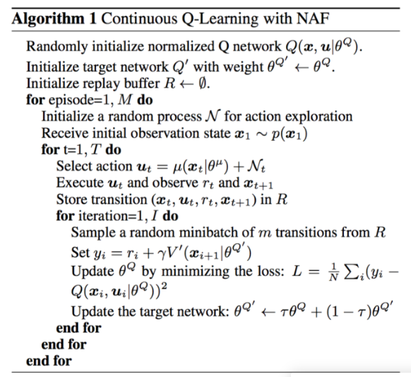

# DRL final project

## 背景(Background)
RL要解決的問題是：讓agent學習在一個環境中的如何行為動作(act)， 從而獲得最大的獎勵值總和(total reward)。
這個獎勵值一般與agent定義的任務目標關聯。
agent需要的主要學習內容：第一是行為策略(action policy)， 第二是規劃(planning)。
其中，行為策略的學習目標是最優策略， 也就是使用這樣的策略，
可以讓agent在特定環境中的行為獲得最大的獎勵值，從而實現其任務目標。

* 行為(action)可以簡單分為：
  * 連續的：如賽車遊戲中的方向盤角度、油門、剎車控制信號，機器人的關節伺服電機控制信號。
  * 離散的：如圍棋、貪吃蛇遊戲。Alpha Go就是一個典型的離散行為agent。
DDPG是針對==連續行為==的策略學習方法。
DQN是針對==離散行為==的學習方法


## 介紹(Introduction)
* 我們使用unity環境，實現機器2個關節手臂接觸移動物體。
* 代理的手在目標位置的每一步都會提供 +0.1 的獎勵。
* 目標: 在盡可能多的時間步長內保持其在目標位置的位置。
* 當代理在 100 個連續episodes中平均得分 +30 時，環境被認為已解決。
* 觀察空間由 33 個變量組成，對應於手臂的位置、旋轉、速度和角速度。每個“動作”是一個有4個數字的向量，對應於適用於2個關節的扭矩。動作向量中的每個條目都必須是 `-1` 和 `1` 之間的數字。



## 安裝環境
To run the code, you need a Python 3.6 environment with required dependencies installed.

1. 創建環境

```
conda create --name reacherproject python=3.6
conda activate reacherproject
```

2. 複製github repository和安裝requirements

```
git clone https://github.com/snow1224/ReacherProject.git
cd ReacherProject
pip install -r requirements.txt
conda install pytorch=0.4.1 cuda92 -c pytorch
```
3. 下載unity環境，選擇對應的OS版本

- **_Version 1: One (1) Agent_**`訓練`
  - Linux: [click here](https://s3-us-west-1.amazonaws.com/udacity-drlnd/P2/Reacher/one_agent/Reacher_Linux.zip)
  - Mac OSX: [click here](https://s3-us-west-1.amazonaws.com/udacity-drlnd/P2/Reacher/one_agent/Reacher.app.zip)
  - Windows (32-bit): [click here](https://s3-us-west-1.amazonaws.com/udacity-drlnd/P2/Reacher/one_agent/Reacher_Windows_x86.zip)
  - Windows (64-bit): [click here](https://s3-us-west-1.amazonaws.com/udacity-drlnd/P2/Reacher/one_agent/Reacher_Windows_x86_64.zip)

- **_Version 2: Twenty (20) Agents_**`推薦`
  - Linux: [click here](https://s3-us-west-1.amazonaws.com/udacity-drlnd/P2/Reacher/Reacher_Linux.zip)
  - Mac OSX: [click here](https://s3-us-west-1.amazonaws.com/udacity-drlnd/P2/Reacher/Reacher.app.zip)
  - Windows (32-bit): [click here](https://s3-us-west-1.amazonaws.com/udacity-drlnd/P2/Reacher/Reacher_Windows_x86.zip)
  - Windows (64-bit): [click here](https://s3-us-west-1.amazonaws.com/udacity-drlnd/P2/Reacher/Reacher_Windows_x86_64.zip)

## DDPG

1. 參數設定可以在`parameters.py`調整

2. 使用 `train_agent.py` 訓練

```
python train_agent.py
```

3.如果想監看使用`train_agent.py`指令的 trained agent， 我們預設將weights和 trained agent儲存在`output\`中。

* result


### DDPG介紹
* 背景
Deepmind在2016年提出DDPG，全稱是：Deep Deterministic Policy Gradient,是將深度學習神經網絡融合進DPG的策略學習方法。
相對於DPG的核心改進是： 採用卷積神經網絡作為策略函數$\mu$和$Q$函數的模擬，即策略網路和Q網路，然後使用深度學習的方法來訓練

* 概念定義：
  * 確定性行為策略$\mu$: 定義為一個函數，每一步的行為可以通過$a_{t} = \mu(s_{t}) $ 計算獲得。
  * 策略網絡：用一個卷積神經網絡對$\mu$函數進行模擬，這個網絡我們就叫做策略網絡，其參數為$\theta^{\mu}$
  * behavior policy $\beta $: 在RL訓練過程中，我們要兼顧2個$e$: exploration和exploit
    * exploration的目的是探索潛在的更優策略，所以訓練過程中，我們為action的決策機制引入隨機噪聲：
    * 將action的決策從確定性過程變為一個隨機過程， 再從這個隨機過程中採樣得到action，下達給環境執行
    
    |:------:|
    |圖1-ddpg架構示意圖|
上述這個策略叫做behavior策略，用β \betaβ來表示, 這時RL的訓練方式叫做==off-policy==.
這裡與$\epsilon-greedy$的思路是類似的。
DDPG中，使用Uhlenbeck-Ornstein隨機過程（下面簡稱UO過程），作為引入的隨機噪聲：
UO過程在時序上具備很好的相關性，可以使agent很好的探索具備動量屬性的環境。


## DQN
### 設定與執行程式
1. 參數設定可以在 `train_agent_dqn.py` 調整

2. 使用 `train_agent_dqn.py` 訓練 

```
python train_agent_dqn.py
```

*	Max_EPISODES = 300, score>=30
*	Result 




### DQN介紹
RL的任務基本是低維度輸入、低維度輸出，這是因為高維的問題難度實在太大了，很難收斂。因此，有人提出了DQN這個專門處理離散Action演算法，使得輸入維度可以擴展到高維空間。

那我們該怎麼建立DQN，讓模型可以輸出Q值，又能輸出與最大Ｑ值對應的Aciton，達到在機械手臂的連續控制的目的呢？圖1為我們針對這個問題所提出的DQN架構。

|:------:|
|圖3-DQN架構示意圖|

一般的DQN在128 relu的隱藏層後，就直接輸出Q，然後找與最大Q對應的action。但我們為了連續控制，我們引入了Advantage概念，也就是判斷每個動作在特定狀況下的優劣，而輸出action也其實就是Advantage最大的動作。關係式如下:

$Q(s,q)=A(s,a)+V(s)$

那我們該如何建立符合我們場域的A的矩陣呢，我們可以利用這個關係式完成：

$A(x,u|\theta^A)=-\dfrac{1}{2}(u-u(x|\theta^u))^TP(x|\theta^P)(u-u(x|\theta^u))$

整體的演算法的流程如下所示：


 
## 參考資料
* [Deep Deterministic Policy Gradient](https://arxiv.org/abs/1509.02971)
* [DQN从入门到放弃7 连续控制DQN算法-NAF](https://zhuanlan.zhihu.com/p/21609472)
* [Deep Cue Learning: A Reinforcement Learning Agent for Pool](https://github.com/pyliaorachel/CS229-pool)
* [pytorch-madrl](https://github.com/ChenglongChen/pytorch-DRL)
* [ddpg原理和算法](https://blog.csdn.net/kenneth_yu/article/details/78478356)